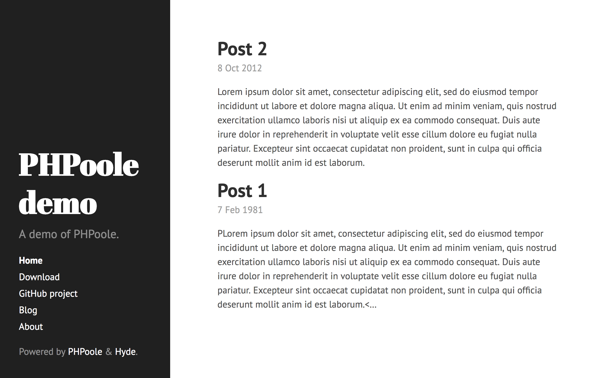

# Hyde theme

[Poole](http://getpoole.com)/[Hyde](https://github.com/poole/hyde) theme for [PHPoole](https://phpoole.org).



## Installation

### Through Composer

```bash
composer require phpoole/theme-hyde
```

### Manually

1. download the source code of the lastest [release](https://github.com/PHPoole/theme-hyde/releases)
2. create a `themes/hyde` directory at the root of your projet
3. copy downloaded files in this directory

## Usage

Add the following line in your `phpoole.yml` configuration file:
```yaml
theme: hyde
```
